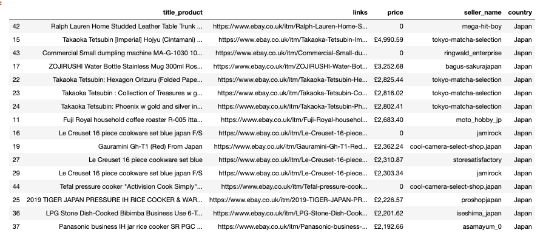

# Data mining 

# Data scraping

## Scraping data from ebay.com
For my client from Japan I scraped data from *ebay* using Python module **requests** and **lxml**.
Output - csv.file

Sample output in **Pandas** dataframe.

# Classification/Regression

# Clustering 

# NLP 

# Chatbot telegram

# Image classification

# Segmentation 
