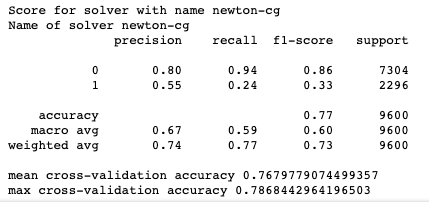

# Data mining 

# Data scraping

## Scraping data from ebay.com
For my client from Japan I scraped data from *ebay* using Python module **requests** and **lxml**.
Output - csv.file

Sample output in **Pandas** dataframe.

# Classification/Regression

## Turnover Analysis for HR - **Binary Classification** using **Logistic regression**.
Trying to find quitting formula. Used Python modules like:
- pandas
- numpy
- sklearn
- matplotlib
- seaborn

## Columns 

**Predicted value(Label)**=left

## Feature selection results

## Results

# Clustering 

# NLP

1) Create trigrams and bigrams from **Hungary** corpus using **pandas** and **regular expresions**.

2) Twitter sentiment analysis using **R**
- rtweet
- tidyverse
- ggplot2
- dplyr
- tidytext

## Most popular words in Twitter post with hashtag #XBOX

## Sentiment histogram of Twitter post with hashtag #XBOX

3) Avito prohibited content

# Chatbot telegram

# Image classification

# Segmentation

# Statistics
